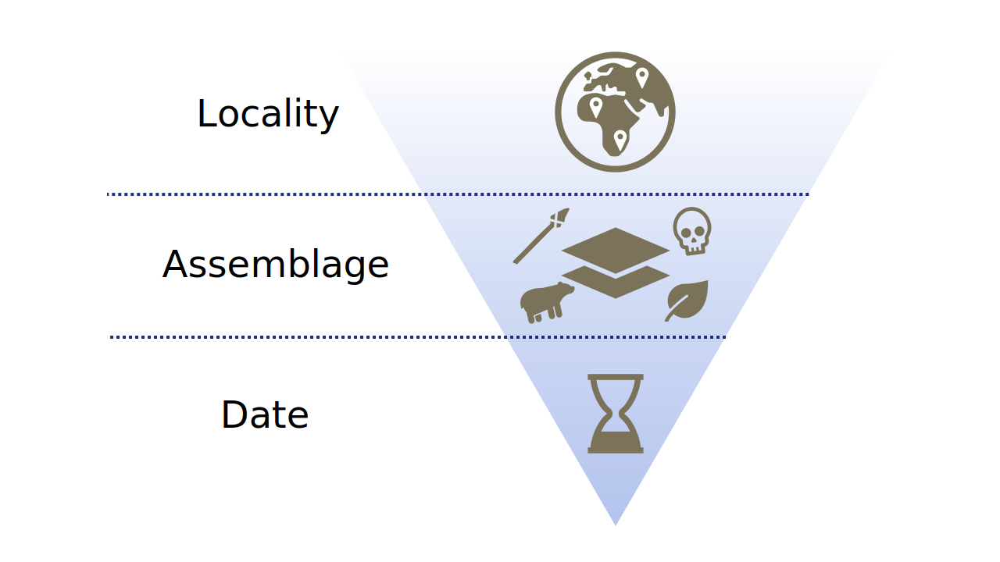

# roadDB  
The aim of the package `roadDB` is to provide access to the [ROCEEH Out of Africa Database (ROAD)](https://www.roceeh.uni-tuebingen.de/roadweb/smarty_road_simple_search.php) and supply users with dataframes for further analysis in the R ecosystem.

## Structure
The roadDB package has three main levels of detail (LOD) that follow a hierarchical order: Locality, Assemblage and Date. A locality can have multiple assemblages, and each assemblage can have multiple dates associated with it.

Users can query information at different LODs using dedicated functions that follow the `road_get_*` naming convention. These return dataframes where each row represents an item at the requested granularity and includes attribute columns relevant to those items.

An extensive set of arguments can be applied to all `road_get_*` functions, allowing users to refine their queries and tailor the results to their needs.

As the ROAD database is exceptionally rich in information at the assemblage level, there are subordinate functions for querying human remains, archaeology, palaeofauna and palaeobotany.

## Functions
- road_get_localities()
- road_get_assemblages()
	- road_get_human_remains()
	- road_get_archaeology()
	- road_get_paleofauna()
	- road_get_paleobotany()
- road_get_dates()

### Arguments
The following arguments are optional and can be used with every `road_get_*` function to constrain queries.

| Argument                  | Type      | ROAD table / attribute                               | Example                                       |
| ------------------------- | --------- | ---------------------------------------------------- | --------------------------------------------- |
| `locality`                  | character | locality / idlocality                                | "Sibhudu Cave"                                |
| `continent`                 | character | country_continent / continent                        | "Africa"                                      |
| `subcontinent`              | character | country_continent / region                           | "Southern Africa"                             |
| `country`                   | character | locality / country                                   | "South Africa"                                |
| `region`                    | character | locality / region                                    | "KwaZulu-Natal"                               |
| `locality_type`             | character | locality / type                                      | "rock shelter"                                |
| `assemblage_name`           | character | assemblage / name                                    | "Sibhudu Cave DMou Archaeological Assemblage" |
| `assemblage_id`             | character | assemblage / idassemblage                            | "154"                                         |
| `geolayer`                  | character | geostrat_describes_geolayer / geolayer_name          | "OMOD"                                        |
| `archaeological_layer`      | character | archaeological_stratigraphy / name                   | "LBG"                                         |
| `age_min`                   | numeric   | assemblage_age / age and negative_standard_deviation | 20000                                         |
| `age_max`                   | numeric   | assemblage_age / age and positive_standard_deviation | 3000000                                       |
| `culture`                   | character | archaeological_layer / archstratigraphy_idarchstrat  | "Post-Howiesonspoort"                         |
| `cultural_period`           | character |  archaeological_stratigraphy / cultural_period       | "Middle Stone Age"                            |
| `archaeological_technology` | character |                                                      |                                               |
| `archaeological_typology`   | character |                                                      |                                               |
| `raw_materials`             | character |                                                      |                                               |
| `archaeological_function`   | character |                                                      |                                               |
| `miscalaneous_finds`        | character |                                                      |                                               |
| `organic_tools`             | character |                                                      |                                               |
| `symbolic_artifacts`        | character |                                                      |                                               |
| `archaeological_feature`    | character |                                                      |                                               |
| `plant_remains`             | boolean   |                                                      |                                               |
| `human_remains`             | boolean   |                                                      |                                               |
| human_genus?              | character |                                                      |                                               |
| human species?            | character |                                                      |                                               |
| `plant_remains`             | boolean   |                                                      |                                               |
| plant_species?            | character |                                                      |                                               |
| `paleofauna`                | boolean   |                                                      |                                               |
| faunal_genus?             | character |                                                      |                                               |
| faunal_species?           | character |                                                      |                                               |
| `animal_remains`            | boolean   |                                                      |                                               |
| further arguments?        |           |                                                      |                                               |
