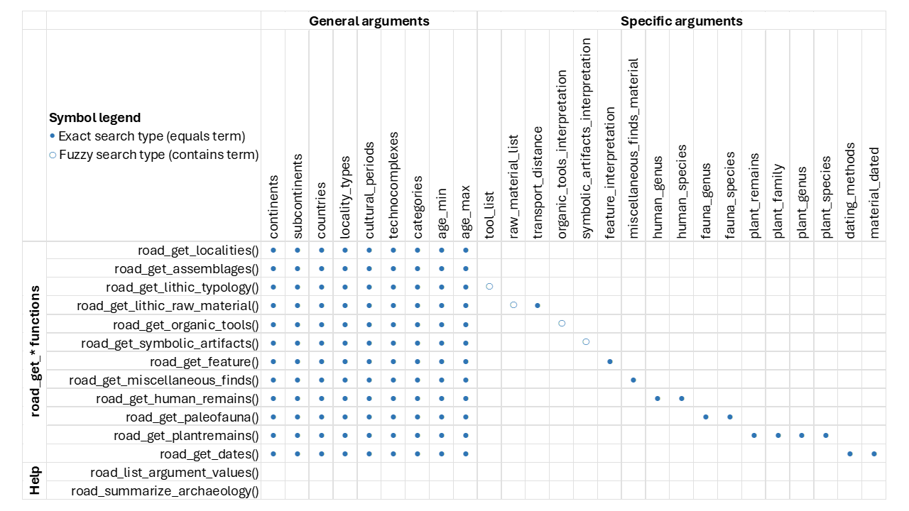
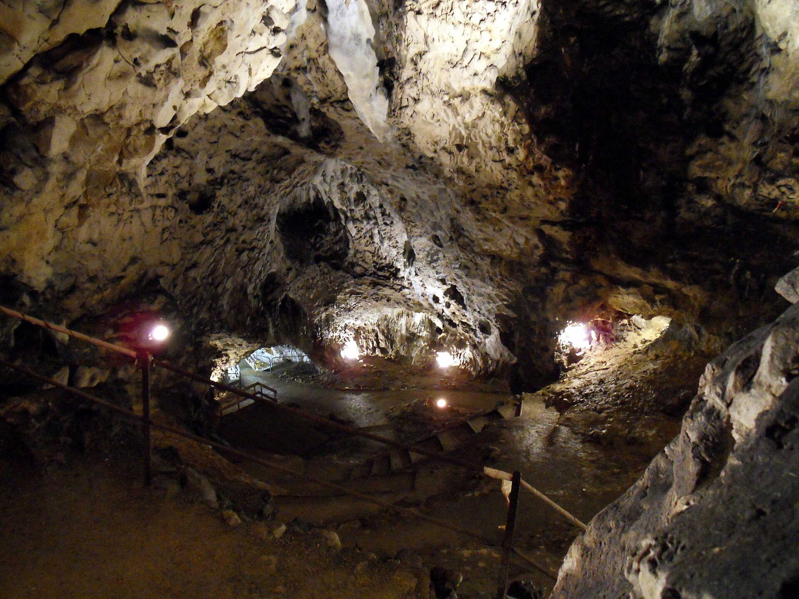

```{r, include = FALSE}
knitr::opts_chunk$set(
  collapse = TRUE,
  comment = "#>"
)
```


Welcome to the R implementation of the *ROCEEH Out of Africa Database* — or simply *ROAD*. This tutorial will introduce the core concepts and guide you through your first steps with the `roadDB` package. In addition, it will offer ideas on how to use `roadDB` alongside other resources available in the R ecosystem.

But first, let's start with the installation.


# Get started

### Install R, RStudio and RTools
Please install a current version of the statistical software `R` and the Integrated Development Environment (IDE) `RStudio` from [https://posit.co/download/rstudio-desktop/]().
Then, please install Rtools from [https://cran.r-project.org/bin/windows/Rtools/]().


### Install roadDB
You only need to install the package once on your R setup, so you can skip this step if it's already installed. Currently, the latest version of `roadDB` can be installed from GitHub. In the future, a stable release will also be available on CRAN.

```{r install, eval=FALSE, include=TRUE}
# Github installation
install.packages("devtools")
devtools::install_github("sommergeo/roadDB")

# CRAN installation (will be made available later)
# install.packages(roadDB)
```

### Load roadDB
After the library has been installed, you can load it every time you run an R session. This will make all the functions available for that session.

```{r setup}
# Load the library
library(roadDB)
```

### First query
Now you are ready to run your first query and inspect the results directly in the R console:

```{r first_query, eval=FALSE, include=TRUE}
my_query <- road_get_localities(cultural_period='Middle Paleolithic')
```


# Basic prinicples
## ROCEEH Out of Africa Database
`roadDB` is an R package designed to provide simplified access to the [ROCEEH Out of Africa Database (ROAD)](https://www.roceeh.uni-tuebingen.de/roadweb/smarty_road_simple_search.php).

Developed over the past 18 years by the [ROCEEH research center](https://www.hadw-bw.de/en/research/research-center/roceeh) (The Role of Culture in Early Expansions of Humans), ROAD integrates a wealth of archaeological, anthropological, and paleoenvironmental data from both Africa and Eurasia, covering a timeframe from 3 million to 20,000 years before present.

The database currently encompasses information on over 28,000 assemblages and 2,600 localities, derived from more than 6,300 publications in over 10 languages. ROAD offers structured data with a high level of both quantity and detail, making it an invaluable resource for quantitative and computational analysis.

However, due to its complexity and expert-level focus, the database can be challenging to navigate and analyze directly. This is why `roadDB` package was implemented as a short-cut into the R ecosystem.

## R implementation
The package aims to provide a simplified, intuitive, and convenient interface for accessing the ROAD database by following a few core principles:

* `roadDB` adopts structures and naming conventions familiar to R users. Instead of writing complex SQL queries, users can retrieve data using **functions**, defined by **arguments**, and receive the results as clean **data frames**.
  
* The resulting data frames follow the [tidy data](https://cran.r-project.org/web/packages/tidyr/vignettes/tidy-data.html) standard, which means:

    - Each **variable** is a column; each column is a variable.
    - Each **observation** is a row; each row is an observation. 
    - Each **value** is a cell; each cell is a single value.

## Background architecture
The roadDB functions are essentially wrappers around complex SQL queries. They interact with a remote copy of the official ROAD database, which is updated four times per year. The current database version is displayed each time you load the package using `library(roadDB)`.

As a result, query results may change over time and might not always reflect the most recent data available through the browser-based interface of ROAD. Keep in mind that ROAD is a continuously expanding database.

Because the package relies on a remote server connection, it requires an active internet connection. Occasionally, the server may experience downtime for maintenance or security checks, particularly during the Christmas holidays.

# How to use roadDB
The use of `roadDB` can be summarized as follows:

* **Functions** starting with `road_get_*` define the structure and content of the output table.
* **Arguments** are optional and allow you to refine your queries using filters.
* **Helper functions** assist in writing more effective and accurate queries.

## road_get_* functions
The `road_get_*` functions are used to query data from the ROAD server. They support three **Levels of Detail (LOD)**, which determine the granularity of the returned data frame. Accordingly, each *row* (or *observation*) in the output will represent a **locality**, an **assemblage**, or a specific **date**, depending on the selected level of detail (see fig. 1)

{width=350px}
**Figure 1:** Three levels of detail determine the granularity of data frame.

Since ROAD contains extensive information at the assemblage level—and because different types of assemblages may include diverse and sometimes unique sets of *columns* (or *variables*)—additional subordinate functions are provided to handle these cases.

A large number of these functions are specifically related to archaeological content. The available functions include:

* `road_get_localities()`
* `road_get_assemblages()`
    - `road_get_human_remains()`
    - `road_get_paleofauna()`
    - `road_get_paleobotany()`
    - `road_get_lithic_typology()`
    - `road_get_lithic_raw_material()`
    - `road_get_organic_tools()`
    - `road_get_symbolic_artifacts()`
    - `road_get_feature()`
    - `road_get_miscellaneous_finds()`
* `road_get_dates()`


## Arguments
Arguments allow you to refine the queries made through the `road_get_*` functions. They are optional—if no arguments are provided, the query returns all available information from ROAD.

In practice, however, most research questions require more focused data. You can tailor your query to your needs by filtering, for example, by continent or cultural_period.

Arguments can also be combined, and you may supply a single value or a list of values.

```{r arguments_example, eval=FALSE, include=TRUE}
# Single argument
road_get_localities(cultural_period='MSA')

# Multiple arguments
road_get_localities(cultural_period='MSA', countries='South Africa')

# Lists of arguments
road_get_localities(cultural_period=c('MSA','LSA'), countries=c('South Africa','Namibia'))
```

The package provides two sets of arguments: 

First, the **general arguments** (tab. 1) which are available for all `road_get_*` functions. These arguments provide flexible ways to filter and refine your queries.

And second, the **function-specific arguments** (tab. 2), which are only available for certain `road_get_*` functions. These arguments refine queries in ways that are unique to the corresponding function. Some of them use *exact* search terms, whereas others use *fuzzy* search.

Figure 2 gives a compact overview over all possible combinations of functions and arguments:

{width=690px}
**Figure 2:** All possible combinations of functions and arguments. [Click here](https://sommergeo.com/roadDB/functions_and_arguments.pdf) for a PDF version.

**Table 1:** General arguments are available for all `road_get_*` functions.

| Argument            | Type      | Example                                       |
| ------------------- | --------- | --------------------------------------------- |
| `continents`        | character | "Africa"                                      |
| `subcontinents`     | character | "Southern Africa"                             |
| `countries`         | character | "South Africa"                                |
| `locality_types`    | character | "rock shelter"                                |
| `categories`        | character | "symbolic artifacts, typology"                |
| `age_min`           | numeric   | 20000                                         |
| `age_max`           | numeric   | 3000000                                       |
| `technocomplexes`   | character | "ESA/ Early Acheulean"                        |
| `cultural_periods`  | character | "Middle Stone Age"                            |

**Table 2:** Function-specific arguments are available for certain `road_get_functions`.

| Argument                            | Type      | Search Type | Example(s)                          |
| ----------------------------------- | --------- | ----------- | ----------------------------------- |
| `dating_methods`                    | character | exact       | "U series (uranium-thorium) dating" |
| `material_dated`                    | character | exact       | "bone"                              |
| `tool_list`                         | character | contains    | "bladelet"                          |
| `raw_material_list`                 | character | contains    | "ironstone banded"                  |
| `transport_distance`                | character | exact       | "regional (6–20 km)"                |
| `organic_tools_interpretation`      | character | contains    | "retoucher"                         |
| `symbolic_artifacts_interpretation` | character | contains    | "anthropomorphic"                   |
| `feature_interpretation`            | character | exact       | "stone construction"                |
| `miscellaneous_finds_material`      | character | exact       | "ostrich egg shell"                 |
| `human_genus`                       | character | exact       | "Homo"                              |
| `human_species`                     | character | exact       | "sapiens"                           |
| `plant_remains`                     | character | exact       | "phytoliths"                        |
| `plant_family`                      | character | exact       | "Anarcadiaceae"                     |
| `plant_genus`                       | character | exact       | "Jasione"                           |
| `plant_species`                     | character | exact       | "Potamogeton gramineus L."          |
| `fauna_genus`                       | character | exact       | "Lemniscomys"                       |
| `fauna_species`                     | character | exact       | "atapuerquensis"                    |


## Helper functions

#### help()

Each function in ROAD comes with detailed documentation, accessible through the standard help() function in R. The documentation describes what the function does, the arguments it accepts, the columns it returns, and how to interpret them.

```{r helper_help, eval=FALSE, include=TRUE}
# Examples
help(road_get_localities)
help(road_get_lithic_typology)
help(road_get_dates)
```


#### road_list_argument_values()

If you are unsure which values are valid for a given argument, use `road_list_argument_values()`.

For instance, you might not know how specific archaeological technocomplexes are spelled in ROAD, or which human genera are available. This helper function returns all unique values for the specified argument, allowing you to explore available options before constructing your query.

```{r helper_argument, eval=FALSE, include=TRUE}
# Examples
road_list_argument_values("countries")
road_list_argument_values("cultural_periods")
road_list_argument_values("human_genus")
```

#### road_summarize_archaeology()

When working with archaeological data, it can be helpful to summarize content across multiple road_get_* functions. For example, you may want to identify all datasets containing the term "egg shell".

The summary table shows which road_get_* functions include the term, and in which columns it appears. This allows you to refine and target your queries more effectively.

```{r helper_summarize, eval=FALSE, include=TRUE}
# Find 'egg shell'
road_summarize_archaeology('egg shell')
```
```{r echo=FALSE}
head(road_summarize_archaeology('egg shell'),4)
```


# Examples
The following examples demonstrate how to query data from ROAD and seamlessly use the results with external R packages. 

Before you begin, please ensure that the required packages are installed on your system. If they are not, install them using the instructions provided below.
```{r, eval=FALSE, include=TRUE}
# Install packages (needs to be done only once)
install.packages("tidyverse")
install.packages("sf")
install.packages("tmap")
install.packages("rcarbon")
```
```{r, warning=FALSE, message=FALSE}
# Load libraries (every time you run this tutorial)
library(roadDB)
library(tidyverse)
library(sf)
library(tmap)
library(rcarbon)
```


## Example #1: Localities

### 1.1 Query localities
You can retrieve a table of all localities stored in ROAD using the function `road_get_localities()`.

Table 1 shows the first few rows of more than 2,000 localities currently available. Each locality is represented as a row, with attributes stored in the columns.

To explore the complete dataset interactively, you can use the `View()` function in RStudio.

```{r localities}
# Query all localities
localities <- road_get_localities()

head(localities)  # head() shows the first 6 rows of a dataset
```


### 1.2 Refine queries
You can narrow down your results by adding optional arguments to `road_get_localities()`.
For example, the query below retrieves only sites from the African continent that are attributed to the Middle Stone Age.

```{r}
# Query selected localities
african_msa_localities <- road_get_localities(continents = "Africa", cultural_periods = "MSA")
head(african_msa_localities)
```

### 1.3 Display a map
Since the dataset contains geographical coordinates in the columns `coord_x` and `coord_y`, you can easily convert the results into a spatial object with the `sf` package and visualize them on an interactive map using the package `tmap`.

```{r ex1.2_map, out.width="100%", eval=FALSE, include=TRUE}
# Load geospatial libraries
library(sf)     # for spatial objects
library(tmap)   # for visualization

# Use coordinate columns to create a spatial dataset
afican_msa_sf <- st_as_sf(african_msa_localities, 
                          coords = c("coord_x", "coord_y"), 
                          crs = 4326)  # WGS84 (lat/lon)

# Choose mapping engine
tmap_mode("plot")  # or "view" for interactive map

# Create map
tm_shape(afican_msa_sf) +
  tm_basemap("OpenStreetMap") +
  tm_dots()
```

```{r, out.width="100%", echo=FALSE, message=FALSE, warning=FALSE}
# Load geospatial libraries
library(sf)     # for spatial objects
library(tmap)   # for visualization

# Use coordinate columns to create a spatial dataset
afican_msa_sf <- st_as_sf(african_msa_localities, 
                          coords = c("coord_x", "coord_y"), 
                          crs = 4326)  # WGS84 (lat/lon)

# Choose mapping engine
tmap_mode("view")  # or "plot" for static map

# Create map
tm_shape(afican_msa_sf) +
  tm_basemap("OpenStreetMap") +
  tm_dots()
```

You can extend this map with various functions included in the [`tmap`](https://r-tmap.github.io/tmap/) package.

### 1.4 Map a technocomplex
Now we’ll generate a map for a technocomplex of your choice.

Before selecting one, it’s helpful to get an overview of the available options. This is where the helper function `road_list_argument_values()` comes in — it allows us to list the unique values that can be used as arguments.

**Use it to display all available technocomplexes, and then choose one that interests you.**

```{r eval=FALSE}
road_list_argument_values("technocomplexes")
```
```{r echo=FALSE}
cat(paste0(paste(head(road_list_argument_values("technocomplexes")$technocomplex,40), collapse = ", "), ", and many more."))
```

Now, adapt the mapping workflow from above to display the technocomplex you selected.

Use your chosen value as argument value in the `road_get_localities` function to generate a map specific to that culture.

```{r ex2.2_map, out.width="100%", eval=FALSE, include=TRUE}
# Query Mousterian sites
mousterian <- road_get_localities(technocomplexes = c("MP/ Mousterian - Eurasia", "MP/ Mousterian - Levant"))

# Create spatial dataset
mousterian_sf <- st_as_sf(mousterian, 
                          coords = c("coord_x", "coord_y"), 
                          crs = 4326)  # WGS84 (lat/lon)

# Display map
tmap_mode("plot")  # or "view" for interactive map

tm_shape(mousterian_sf) +
  tm_basemap("OpenStreetMap") +
  tm_dots(
    col = "technocomplexes",
    palette = "Set2")+
  tm_layout(legend.outside = TRUE)

```


```{r, out.width="100%", echo=FALSE, message=FALSE, warning=FALSE}
# Query Mousterian sites
mousterian <- road_get_localities(technocomplexes = c("MP/ Mousterian - Eurasia", "MP/ Mousterian - Levant"))

# Create spatial dataset
mousterian_sf <- st_as_sf(mousterian, 
                          coords = c("coord_x", "coord_y"), 
                          crs = 4326)  # WGS84 (lat/lon)

# Display map
tmap_mode("view")  # or "view" for interactive map

tm_shape(mousterian_sf) +
  tm_basemap("OpenStreetMap") +
  tm_dots(
    col = "technocomplexes",
    palette = "Set2")+
  tm_layout(legend.outside = TRUE)

```
As you can see, the map can be customized using the arguments available in  [`tmap::tm_dots()`](https://r-tmap.github.io/tmap/reference/tm_symbols.html).

In this example, we visualize different technocomplex categories by setting the `col` argument (which determines what variable is used for coloring — here, `mousterian$technocomplexes`) and the palette argument (which specifies the color scheme to use).

Once you have transferred your dataset to a spatial datatype, there are many interresting packages available, that make use of the spatial data in ROAD:
- [`spatstat`](https://cran.r-project.org/web/packages/spatstat/vignettes/getstart.pdf) for spatial point pattern analysis, kernel density, etc.
- [`spatial`]() for interpolation, Kriging and point pattern analysis
- [`gstat`]() for modelling, prediction and simulation


## Example #2: Assemblages

Moving to the next levet of detail (LOD) of roadDB we will now query assemblages. In the same way as we are able to make a query for all localitites in ROAD, we can similarly query for all assemblages that make up those localities.

### 2.1 Lithic Tools

If we stay with our Mousterian people or a bit, we can go into more detail and look at the lithic tools that are present at the localities using the `road_get_lithictypology()` function.

```{r}
mous_tools <- road_get_lithic_typology(technocomplexes = c("MP/ Mousterian - Eurasia", 
                                                           "MP/ Mousterian - Levant"))
```

We can then inspect our result.

```{r}
head(mous_tools)
```

So this tool list as a bit hard to get an overview of, but if we know what were looking for, then we can specify this using the `tool_list()` function which can be used together with the `road_get_lithic_typology()` function. We can first use the `road_list_argument_values()` function to see what our choices are.

```{r}
road_list_argument_values("tool_list")
```

This gives us an alphabetical list of all *tool types*. Let us look for all instances of Levallois technology, a defining elemnent of the Mousterian tradition. The term *Levallois* occurs in many different cases and in combination with many different words/categories. Luckily, we do not need the entire entry with the `tool_list()` function and can just enter *levallois*.

```{r}
mous_levallois <- road_get_lithic_typology(technocomplexes = c("MP/ Mousterian - Eurasia", 
                                                               "MP/ Mousterian - Levant"),
                                           tool_list = "levallois")
```

Now we have all assemblages with levallois technology present. Let us see how many Mousterian assemblages there are in comparison to assemblages with levallois technology. And let us see how they are distributed across different countries. For that we can use ggplot. But first we need to combine the two dataframes. In order for us to know which rows come from which dataframe once it is merged, we need to give them a new column each with to identify them later for the plot.

```{r}
# Add a new column called 'source' to each dataset
mous_levallois$source <- "Levallois" # label all rows in this dataframe
mous_tools$source     <- "Mousterian" # label all rows in this dataframe

# Combine the two dataframes into one
combined <- rbind(mous_levallois, mous_tools)
```

Now we have our combined dataset and we are ready for plotting.

```{r fig.width=7, fig.height=7}
# Plot the combined data in a bar plot
ggplot(combined, aes(x = fct_infreq(country), # x-axis = countries ordered by how often they appear
                     fill = source)) + # colour of the bars is determined on the source columns
  geom_bar(position = "dodge") + # draw side-by-side bars for each 'source'
  coord_flip() + # flip coordinates to make horizontal bars
  labs(
    title = "Levallois vs. Mousterian", # Plot title
    x = NULL, # remove x-axis label as countries are self explanatory
    y = "Assemblages (n=)", # label the y-axis
    fill = "Key" # legend title
  ) +
  scale_y_continuous(breaks = scales::pretty_breaks(n = 10)) + # clean axis ticks
  theme_minimal(base_size = 12) # simple theme and larger font for readability
```


### 2.2 Ostrich egg shells

Ostrich eggshells are an interesting material with a variety of uses. In this exercise, we'll create a quick graph to visualize their appearance across different cultural periods.

First, we can use `road_summarize_archaeology()` to get an overview of the tables in which these items can be found. The search term *ostrich eggshell* appears in two tables: `miscellaneous finds` and `symbolic artifacts`. In these tables, the term is found in the attributes `material` and `comments`, and the hit count indicates how many rows contain these items.

```{r}
road_summarize_archaeology('ostrich egg shell')
```

In the next step, we can use this information to run the appropriate query functions: `road_get_miscellaneous_finds()` and `road_get_symbolic_artifacts()`.

We then combine the two data frames using the [`tidyverse::full_join()`](https://dplyr.tidyverse.org/reference/mutate-joins.html) function.

```{r}
# Query from miscellaneous finds
eggshell_misc <- road_get_miscellaneous_finds() # download whole dataframe
eggshell_misc <- filter(eggshell_misc, str_detect(miscellaneous_finds_material, 'ostrich egg shell')) # filter for search string

# Query from symbolic artifacts
eggshell_symbolic <- road_get_symbolic_artifacts() # download whole dataframe
eggshell_symbolic <- filter(eggshell_symbolic, str_detect(symbolic_artifacts_material, 'ostrich egg shell')) # filter for search string

# Combine results
eggshell_combined <- full_join(eggshell_misc, eggshell_symbolic, by = c("locality_id", "assemblage_id", "continent", "subcontinent", "country", "locality_types", "coord_x", "coord_y", "assemblage_name", "categories", "age_min", "age_max", "cultural_periods", "technocomplexes"))
```

Finally, we can visualize the results in a simple bar chart.
```{r fig.width=7}
ggplot(eggshell_combined, aes(y = cultural_periods)) +
  geom_bar() +
  labs(
    title = "Ostrich egg shells",
    x = "Number of assemblages",
    y = "Cultural period")
```


For Advanced Users

*What is the difference between these two ways of merging the two data frames?*

*Adapt the plot from above to compare the outputs of both approaches. Try to understand how the differences in merging affect the final visualization.*
```{r}
# Version 1
eggshell_combined1 <- full_join(eggshell_misc, eggshell_symbolic, by = c("locality_id", "assemblage_id", "continent", "subcontinent", "country", "locality_types", "coord_x", "coord_y", "assemblage_name", "categories", "age_min", "age_max", "cultural_periods", "technocomplexes"))

# Version 2
eggshell_combined2 <- bind_rows(eggshell_misc, eggshell_symbolic)

```


## Example #3: Dates
Throughout this tutorial, you may have noticed the columns `age_min` and `age_max`, ROAD's own age estimates based on a combination of all available temporal information, including cultural and radiometric dates — essentially a best guess.

However, if the temporal aspect is crucial for your research, for example a time series analysis, it is important to look at the actual data rather than aggregates.

This is especially true for radiocarbon ages, which are stored as uncalibrated dates in ROAD, and which require you to perform and customize your own age modelling.

For this reason, we implemented `road_get_dates()`.


### 3.1 Filter dates

Let's have a look at Hohle Fels, a well-known Paleolithic cave site in the Swabian Jura with plenty of dates. 

{width=350px}

**Figure 3:** Inside the UNESCO site "Hohle Fels" | [CC BY-SA Thilo Parg](https://commons.wikimedia.org/wiki/File:Hohler_Fels_Halle_Achtal_Schelklingen.jpg)

First, we'll get an overview of all the available data, and then use [`tidyverse::filter()`](https://dplyr.tidyverse.org/reference/filter.html) to narrow down our results.

*Try to answer these questions:*

- *How many dates are there altogether?*

- *How many radiocarbon dates are there?*

- *Which technocomplexes are present at the site?*


```{r message=FALSE, warning=FALSE}
# Load all dates
all_dates <- road_get_dates() 

# Now filter the column locality_id for the value "Hohle Fels"
hohle_fels_dates <- filter(all_dates, locality_id == "Hohle Fels")

```

{width=350px}

**Figure 4:** Flute from the Aurignacian layers of Hohle Fels | H. Jensen/Universität Tübingen 

Hohle Fels is known for a number of fascinating finds, including one nearly complete bone flute and fragments of three ivory flutes that were excavated from archaeological layer Vb ([Conard et al. 2009](https://www.nature.com/articles/nature08169)). The radiocarbon ages for this layer were derived from bone and charcoal and were analyzed at the Oxford Radiocarbon Accelerator Unit and the Leibniz Laboratory in Kiel.
We can extend our filter to select this archaeological layer. With [`str_detect`]() we can also address specific terms withing cells.

```{r message=FALSE, warning=FALSE, eval=TRUE}
# Filter for archaeological layer Vb
hohle_fels_Vb <- filter(hohle_fels_dates, archlayer=="AH Vb")

# Extend filter for symbolic artifacts
hohle_fels_Vb <- filter(hohle_fels_Vb, str_detect(categories, "symbolic artifacts"))
```

We'll calibrate layer Vb ages using the R package [`rcarbon`](https://cran.r-project.org/web/packages/rcarbon/vignettes/rcarbon.html). Since the site is located in the Northern Hemisphere, we'll use the "IntCal20" calibration curve ([Reimer et al. 2020](https://doi.org/10.1017/RDC.2020.41)).

### 3.2 Calibrate

```{r message=FALSE, warning=FALSE, eval=TRUE}
# Load radiocarbon library
library(rcarbon)

# Calibrate
hohle_fels_Vb_cal <- calibrate(x=hohle_fels_Vb$age,
                           errors=hohle_fels_Vb$positive_standard_deviation,
                           calCurves='intcal20')
```

Now the calibrated ages can be diyplayed with `summary()`.
```{r message=FALSE}
# Display calibrated ages
summary(hohle_fels_Vb_cal)
```

You can also visualize the results with `plot()` and `multiplot()`.
```{r message=FALSE, warning=FALSE}
# Visualize the first date
plot(hohle_fels_Vb_cal,1)
```

```{r message=FALSE, warning=FALSE}
# Visiualize all dates, with numbers indicating row number
multiplot(hohle_fels_Vb_cal,
          decreasing=TRUE,
          rescale=TRUE,
          HPD=TRUE,
          label.pos=0.9,
          label.offset=-200) 
```

The radiocarbon analyses were based on an excellent [introduction](https://cran.r-project.org/web/packages/rcarbon/vignettes/rcarbon.html) into the [`rcarbon`] software. Using this you can extend your `roadDB` workflow to create [Summed Probability Distributions (SPDs)](https://cran.r-project.org/web/packages/rcarbon/vignettes/rcarbon.html#aggregating-14c-dates-summed-probability-distributions-spd), [temporal composite kernel density estimates (CKDE)](https://cran.r-project.org/web/packages/rcarbon/vignettes/rcarbon.html#composite-kernel-density-estimates-ckde) or [spatio-temporal](https://cran.r-project.org/web/packages/rcarbon/vignettes/rcarbon.html#spatial-analysis) analyses, for example.

# Further Reading

[Ben Marwick: How To Do Archaeological Science Using R](How To Do Archaeological Science Using R)

[Open-Archaeo: A list of open source archaeological software and resources](https://github.com/zackbatist/open-archaeo)

```{r eval=FALSE, include=FALSE}
rmarkdown::render(
  input = "vignettes/articles/roadDB.Rmd",
  output_file = "tutorial.html",
  output_dir = "docs"
)
```

